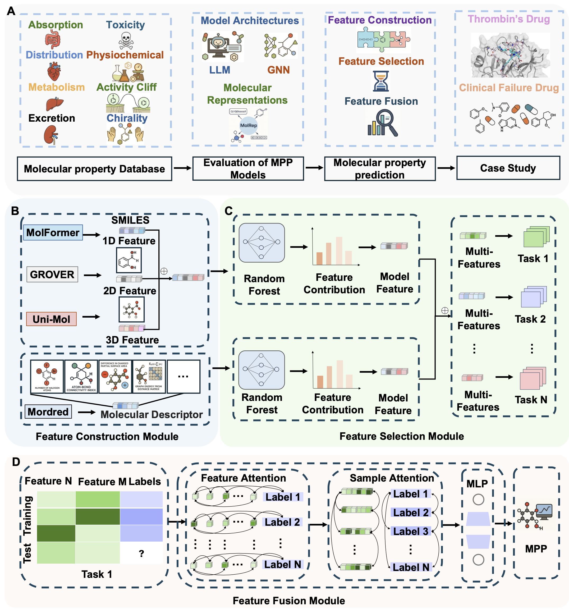

# Adaptive Modality-Complementary Molecular Representation Framework for Accurate Prediction of Structure-Sensitive Properties

**Molecular structure-sensitive properties (SSP)**, such as **activity cliffs** and **chirality**, can **change abruptly** with subtle **motif-level** or **stereochemical** perturbations. Understanding SSP supports **lead optimization** and guides MPP models to capture **non-smooth** structure–property relationships. **Multimodal representations** perform well on conventional tasks, but their SSP contributions remain **unquantified**, and **multimodal redundancy** may reduce sensitivity to fine structural changes. We present **CAMF (Chirality- and Activity-cliff–aware Multimodal Framework)**, **an adaptive framework for modality-complementary molecular representations that accurately predicts SSP**. We curate **77** ADMET and physicochemical tasks to benchmark **feature extractors** and **assemble complementary multimodal representations**. **Random-forest** feature selection reduces redundancy, and a **bidirectional attention** module quantifies cross-modality contributions while capturing subtle structural variation. CAMF improves mean R² by **29.5%** on activity-cliff datasets and reduces MAE by**23.3%** on **90,364** chiral molecules with TD-DFT **optical rotatory** strengths over baselines. SHAP analysis of **thrombin ligands** highlights a **six-membered aromatic ring** as a key activity motif. Ablation study shows that **different molecular modalities provide complementary information** for MPP. **Only when this complementarity is coupled with adaptive mechanism can subtle structural changes be captured and SSP be accurately modeled and predicted**. Case studies on **rofecoxib cardiotoxicity** and **obeticholic-acid hepatotoxicity** illustrate utility for real-world efficacy.



## Setups

```bash
git clone https://github.com/linshaolong11/CAMF.git
cd CAMF
mamba env create -f environment.yaml
mamba activate CAMF
```

## Datasets
Due to the large size of the original training dataset **MPPDB**, it is not suitable for direct upload to GitHub. Therefore, we have hosted it on [Zenodo](https://zenodo.org/records/17310984/files/MPPDB.zip).

Please download the dataset from the link above and extract it into the `./data` directory before running the training or evaluation scripts.

```bash
cd data 
wget https://zenodo.org/records/17310984/files/MPPDB.zip
unzip MPPDB.zip
```


## Train

We provide an example of training using the bbb_logbb dataset. You need to specify the input file path, task type (classification or regression), and the output file path for saving the trained model.

```bash
python train.py --input data/bbb_logbb.pkl --task_type classification --output result/out_bbb_logbb.pkl
```

This will train a CAMF model on the given dataset and save the trained model to the specified location.

## Evaluation

To evaluate a trained CAMF model, specify the path to the saved model file, the input dataset, and the task type (classification or regression):

```bash
python evaluate.py --model result/out_bbb_logbb.pkl --input data/bbb_logbb.pkl --task_type classification
```
This script will load the model and evaluate its performance on the test set contained in the specified dataset. 

## Others

For questions, issues, or dataset requests, please contact us directly at `shaolonglin2023@163.com`.
