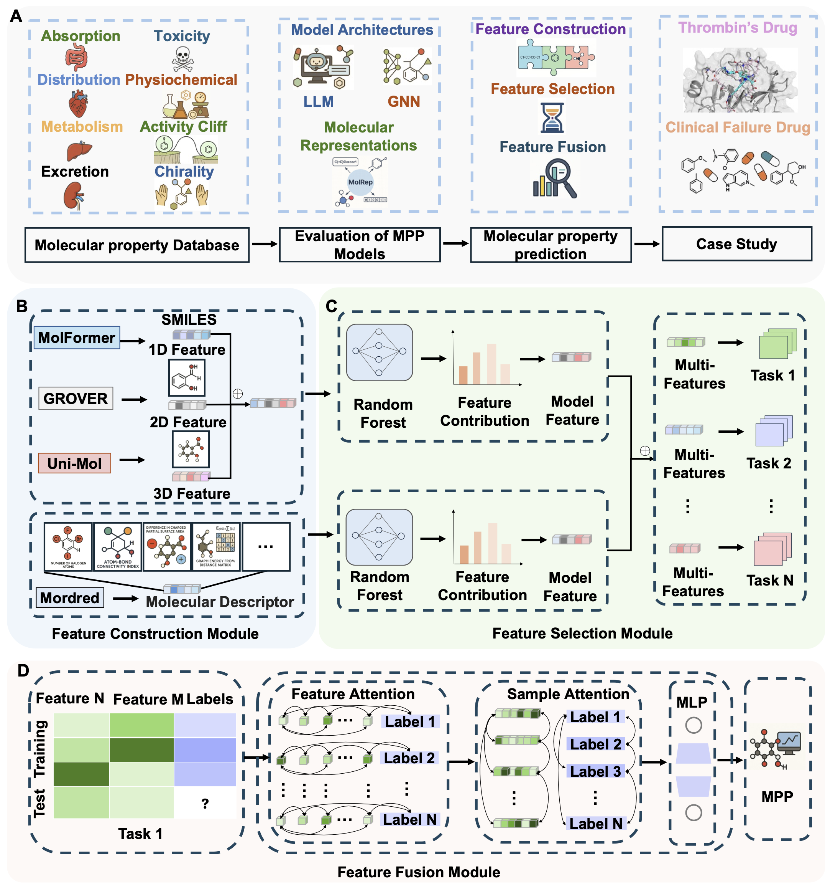

# Task-adaptive multimodal molecular representations for structure-sensitive property prediction

**Structure-sensitive properties (SSPs)**, including **activity cliffs** and **chirality-dependent properties**, challenge molecular machine learning because **small structural perturbations** can cause **abrupt property changes** and **invalidate smooth structure–property assumptions**. Here, we present **CAMF (Chirality- and Activity-cliff-aware Multimodal Framework)**, a **task-adaptive framework** that models SSPs through selective integration of complementary molecular evidence. To systematically evaluate this problem, we construct **SSPBench**, a benchmark spanning **77 conventional ADMET and physicochemical tasks** together with **activity-cliff** and **chirality-sensitive** benchmarks. CAMF integrates **molecular embeddings** and **expert-defined descriptors** using **random-forest-based feature selection** and **adaptive fusion**, enabling **property-specific prioritization** of informative signals while **reducing multimodal redundancy**. Across ten baselines, CAMF achieves the best overall performance on SSP tasks, improving mean R² by up to **29.5% on activity-cliff datasets** and reducing MAE by up to **23.3% on 90,364 chiral molecules** with TD-DFT-computed optical rotatory strengths. Ablation analyses show that these gains arise from **task-adaptive multimodal integration** rather than naive feature concatenation. More broadly, our results reveal that modality relevance is **strongly task-dependent**, with descriptors and 3D geometry becoming especially important in non-smooth property regimes. **Case studies** further support the **interpretability** and **practical utility** of CAMF in identifying activity-associated substructures and clinically relevant toxicity liabilities.



## Setups

```bash
git clone https://github.com/linshaolong11/CAMF.git
cd CAMF
mamba env create -f environment.yaml
mamba activate CAMF
```

## Datasets
Due to the large size of the original training dataset **SSPBench**, it is not suitable for direct upload to GitHub. Therefore, we have hosted it on [Zenodo](https://zenodo.org/records/21253431/files/SSPBench.zip).

Please download the dataset from the link above and extract it into the `./data` directory before running the training or evaluation scripts.

```bash
cd data 
wget https://zenodo.org/records/21253431/files/SSPBench.zip
unzip SSPBench.zip
```


## Train

We provide an example of training using the BBB_logbb dataset. You need to specify the input file path, task type (classification or regression), and the output file path for saving the trained model.

```bash
python train.py --input data/BBB_logbb.pkl --task_type classification --output result/out_BBB_logbb.pkl
```

This will train a CAMF model on the given dataset and save the trained model to the specified location.

## Evaluation

To evaluate a trained CAMF model, specify the path to the saved model file, the input dataset, and the task type (classification or regression):

```bash
python evaluate.py --model result/out_BBB_logbb.pkl --input data/BBB_logbb.pkl --task_type classification
```
This script will load the model and evaluate its performance on the test set contained in the specified dataset. 

## Others

For questions, issues, or dataset requests, please contact us directly at `shaolonglin2023@163.com`.
